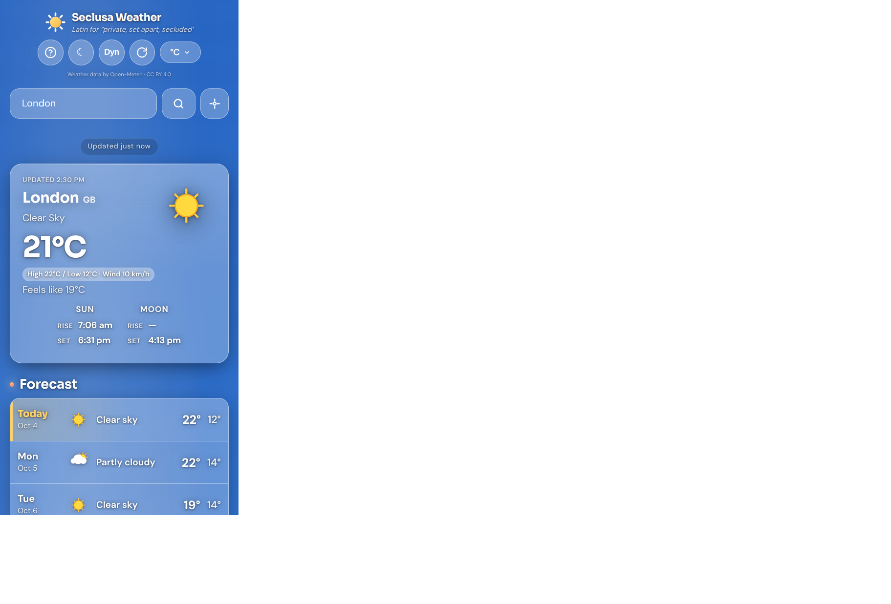
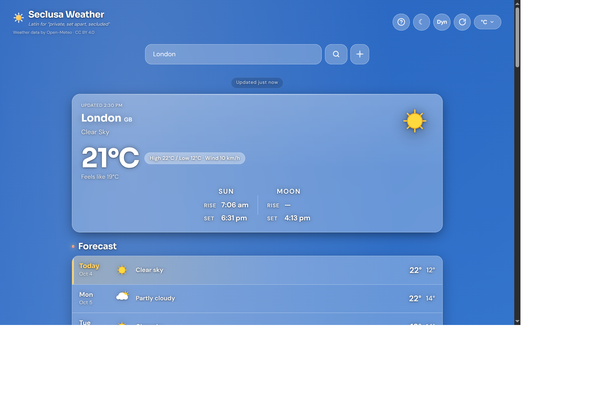

<p align="center">
  
</p>

<h1 align="center">Seclusa Weather</h1>

<p align="center">
  <em>Privacy-first weather PWA — zero tracking, no accounts, no API keys.</em><br>
  <em>Seclusa — from the Latin for “private”, “secluded”, “set apart”.</em>
</p>

<p align="center">
  <a href="LICENSE"></a>
  <a href="https://github.com/ambr3/SeclusaWeather/commits/main"></a>
  
  
</p>

<p align="center"><strong>v0.6.5</strong></p>

<p align="center">
  
  
  
</p>

---

Pure static weather app. Preferences and the cached forecast stay on your device; the only outbound calls are to [Open-Meteo](https://open-meteo.com/) (weather, air quality, geocoding). Installable, offline-capable, auditable end-to-end.

### A note from me

I’m not a professional web developer — I’ve used AI a lot while building this, and I’m transparent about that. Audit the code before you rely on it; everything is GPL-3.0 and open to review.

## Features

- Current, hourly (day-paged + multi-metric chart), and 7/14-day forecast
- Sunrise/sunset arc, UV, air quality (EU/US AQI), pollen
- Wind compass (no map tiles); geolocation opt-in on button tap only
- Dark / light themes, weather backgrounds, metric / imperial
- Auto-refresh every 30 minutes once a place is set

## Privacy

- **Zero tracking** — no analytics, cookies, fingerprinting, or third-party scripts
- **No server / no API key** — static site; Open-Meteo only
- **On-device** — preferences and forecast cache in localStorage; snapshot expires after 7 days
- **What leaves** — coordinates / search queries for the active place go to Open-Meteo; nothing else
- **Erase anytime** — Help → Erase my data
- Camera, mic, sensors, payment blocked; embedding best-effort blocked

Fresh installs and after erase show an empty start (search or locate) — no silent default city.

## Install

Open the live site (or serve this folder) and **Install** / **Add to Home screen**. Offline after first load.

Self-host as static files. Prefer Netlify / Cloudflare Pages / Vercel / Apache so `_headers`, `vercel.json`, or `.htaccess` apply (CSP, frame-ancestors, HSTS). GitHub Pages ignores those files — in-page CSP still locks scripts/connect.

```bash
bash scripts/smoke.sh
```

## License

GPL-3.0 — see [LICENSE](LICENSE).

Bundled UI fonts (**DM Sans**, **Sora**) are SIL OFL 1.1 — served locally, no font CDN.
